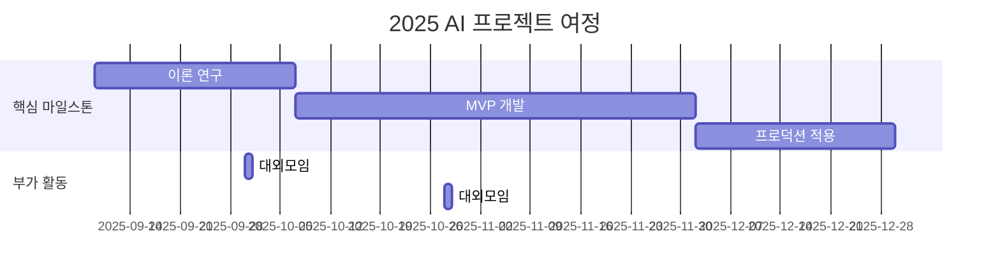

<h1 align="center"> 🪏 Query VendingMachine(쿼리 자판기) </h1>

<div align="center">
<a href="https://pseudo-lab.com"></a>
<a href="https://discord.gg/EPurkHVtp2"></a>
<a href="https://github.com/Pseudo-Lab/10th-template/stargazers"></a>
<a href="https://github.com/Pseudo-Lab/10th-template/network/members"></a>
<a href="https://github.com/Pseudo-Lab/10th-template/pulls"></a>
<a href="https://github.com/Pseudo-Lab/10th-template/issues"></a>
<a href="https://github.com/Pseudo-Lab/10th-template/graphs/contributors"></a>
<a href="https://hits.seeyoufarm.com"></a>
</div>
<br>

<!-- sheilds: https://shields.io/ -->
<!-- hits badge: https://hits.seeyoufarm.com/ -->

> Welcome to Text2SQL Study repository! We aim to explore natural language interfaces to databases, offering tools and frameworks for SQL learning, prompt engineering, and query evaluation. Join us in advancing the field of Text2SQL through open collaboration and innovation!

🚀 Query VendingMachine — 가짜연구소 Text2Sql 프로젝트


## 🌟 프로젝트 목표 (Project Vision)
### "Text2SQL 기초 구현부터 실험까지 함께 공부하는 Text2Sql 스터디"
- Text2SQL의 환경을 직접 구축
- 실무, 논문 아이디어를 적용한 구현 및 실험
- 실제 업무의 적용할 아이디어와 노하우 정리
- [프로젝트 계획 노션 페이지](https://www.notion.so/chanrankim/Text2Sql-255963ffa3ee80a688b7c082b905e551?d=1ba963ffa3ee83db9e6f83f9a30be927)

## 🧑 역동적인 팀 소개 (Dynamic Team)

| 역할          | 이름 | 기술 스택 배지                                                                                                                                                                   | 주요 관심 분야       |
|---------------|------|----------------------------------------------------------------------------------------------------------------------------------------------------------------------------|----------------|
| **Project Manager** | 이청록 |                                                         | AI/추천 서비스 엔지니어링 |
| **Member** | 변홍균 |   | 데이터 분석, 엔지니어링  |
| **Member** | 양문규 |                                                              | 머신러닝 엔지니어      |
| **Member** | 박지우 |                                                           | 데이터 엔지니어링      |
| **Member** | 이현준 |                                                      | LLM 프로덕트 전문가   |


## 🚀 프로젝트 로드맵 (Project Roadmap)



## 🛠️ 우리의 개발 문화 (Our Development Culture)
**우리의 개발 문화**  
```python
class CollaborationFramework:
    def __init__(self):
        self.tools = {
            'communication': 'Discord',
            'version_control': 'GitHub Projects',
            'ci/cd': 'GitHub Actions',
            'docs': 'Github Wiki'
        }
    
    def workflow(self):
        return """주간 사이클:
        1️⃣ 화요일: 리뷰 및 공유"""
```


## 📈 성과 지표 (Achievement Metrics)
**2024 주요 KPI**  
| 지표                     | 목표치 | 현재 달성률 |
|--------------------------|--------|-------------|
| 커밋 수                    | 500  | 5%         |
| 쿼리 정확도                 | 90%    | 50%         | 


## 💻 주차별 활동 (Activity History)

| 날짜 | 내용 | 결과물                  | 
| -------- | -------- |----------------------|
| 2025/09/09 |  1주차      | OT                   |
| 2025/09/16 |  2주차 | 리서치 결과 공유            | 
| 2025/09/23 |  매지컬 위크 | t2s 환경 리서치 및 개발 결과 공유 | 
| 2025/09/30 |  3주차 | t2s 환경 리서치 및 개발 결과 공유 | 
| 2025/10/07 |  4주차 | t2s 환경 리서치 및 개발 결과 공유 | 
| 2025/10/14 |  5주차 | t2s 환경 리서치 및 개발 결과 공유 | 
| 2025/10/21 |  6주차 | t2s 환경 리서치 및 개발 결과 공유 | 
| 2025/10/28 |  7주차 | 미정                   | 
| 2025/11/04 |  8주차 | 미정                   | 
| 2025/11/11 |  9주차 | 미정                   | 
| 2025/11/18 |  10주차 | 미정                   | 
| 2025/11/25 |  11주차 | 미정                   | 
| 2025/12/02 |  12주차 | 미정                   | 
| 2025/12/09 |  13주차 | 미정                   | 
| 2025/12/16 |  14주차 | 미정                   | 
| 2025/12/23 |  15주차 | 미정                   | 
| 2025/12/30 |  16주차 | 미정                   | 


## 💡 학습 자원 (Learning Resources)
**우리가 만든 지식 허브**  
- github wiki


## 🌱 참여 안내 (How to Engage)
- 빌더로 참여 — 프로젝트 기획·운영·개발 주도
- 러너로 참여 — 연구·개발 등 실행
- 청강 참여 — 공개 세션 참여 가능

❗️참여 링크: [가짜연구소 디스코드](https://discord.gg/EPurkHVtp2)
❗️커뮤니케이션 채널: 디스코드 #{{채널명}}

**누구나 청강을 통해 모임을 참여하실 수 있습니다.**  
1. 특별한 신청 없이 정기 모임 시간에 맞추어 디스코드 #Room-GH 채널로 입장
2. Magical Week 중 행사에 참가
3. Pseudo Lab 행사에서 만나기

## Acknowledgement 🙏

이 프로젝트는 가짜연구소 Open Academy로 진행됩니다.
여러분의 참여와 기여가 ‘우연한 혁명(Serendipity Revolution)’을 가능하게 합니다. 모두에게 깊은 감사를 전합니다.
OOO is developed as part of Pseudo-Lab's Open Research Initiative. Special thanks to our contributors and the open source community for their valuable insights and contributions.

## About Pseudo Lab 👋🏼</h2>

[Pseudo-Lab](https://pseudo-lab.com/) is a non-profit organization focused on advancing machine learning and AI technologies. Our core values of Sharing, Motivation, and Collaborative Joy drive us to create impactful open-source projects. With over 5k+ researchers, we are committed to advancing machine learning and AI technologies.

<h2>Contributors 😃</h2>
<a href="https://github.com/Pseudo-Lab/10th-template/graphs/contributors">
  
</a>
<br><br>

<h2>License 🗞</h2>

This project is licensed under the [MIT License](https://opensource.org/licenses/MIT).

🚩 추가 팁 (Usage Tips)
- 각 항목 내 {{ }} 표시된 부분을 프로젝트에 맞게 꼭 수정하세요.
- 불필요한 프로젝트 유형 예시는 제거하거나 교체해 명확하게 하세요.
- 로드맵과 활동내역 부분에 Mermaid 다이어그램 등을 이용해 시각적으로 표현하는 것을 추천합니다.
- 체크박스(✅)와 표를 적절히 활용하면 진행 상황 한눈에 파악이 쉽습니다.
- ‘빌더’와 ‘러너’의 역할 분담과 상호 피드백 문화 강화에 README 내 문장으로 강조를 절대 잊지 마세요.
- README가 단순 안내서 이상으로 공동체 철학과 가치를 담는 협업 선언문임을 인지하고, 누구나 읽고 이해하기 쉽도록 간결 명료하게 작성하세요.

---
## 초기 환경 셋팅

> 클론
```
git clone git@github.com:Pseudo-Lab/Query-VendingMachine.git
cd Query-VendingMachine
```
      
>파이썬 가상환경
```
python -m venv .venv
source .venv/bin/activate
```

>컨테이너 실행
```
# .env 폴더에 본인의 API KEY를 반드시 입력한 다음에 아래의 명령어를 실행해주세요.
docker compose build --no-cache
docker compose up -d
```

>테스트셋 구축
```
# experiments 폴더에 테스트셋이 구축됩니다.
python testset.py

```

>실험
```
# streamlit 실험결과 탭 내에서 실험을 진행할 수 있습니다.

탭 내 버튼을 눌러 실험을 진행할 수 있습니다. 실험결과는 experiments/ 폴더에 각 실험번호 내에 저장됩니다.

실험 진행 로그 확인 docker logs -f text2sql-web --tail 10

```

---
## Phoenix 기반 디버깅/모니터링
- 목적: LangChain 호출/SQL 생성 과정을 Phoenix UI에서 추적
- 기본 포트: 6006 (로컬/도커 동일)

### 가상환경(로컬) 실행 순서
1) Phoenix 서버 기동  
```bash
phoenix serve
```
2) 패키지 설치 및 앱 실행  
```bash
pip install -r requirements.txt  # arize-phoenix 포함
streamlit run main.py
```

### Docker 실행 순서
1) 컨테이너 올리기 (Phoenix 포함)  
```bash
docker compose up -d phoenix db web
```
2) 로그 확인  
```bash
docker logs -f text2sql-web --tail 20
```

### 설정 토글
- `PHOENIX_SERVER_URL`로 서버 주소 지정 (기본: 로컬 `http://localhost:6006`, 컨테이너 내부는 `http://phoenix:6006`)
- `ENABLE_PHOENIX=0`으로 계측 비활성화 가능

### (추가) Datasets & Experiments: 테스트셋 업로드 + 실행결과 동치 평가
- 목적: `experiments/*.csv` 테스트셋을 Phoenix Dataset으로 올리고, **Execution-match(실행 결과 동치)** 기준으로 실험/비교
- 표시 위치: Phoenix UI 좌측 `Datasets & Experiments`

#### 1) Dataset 업로드
```bash
python experiments/phoenix_upload_datasets.py --all
```

#### 2) 실험 실행(Execution-match 평가 포함)
```bash
# 기본 테스트셋
python experiments/phoenix_run_experiment.py --dataset dvdrental-basic --name "baseline-seed-off"

# 고급 테스트셋
python experiments/phoenix_run_experiment.py --dataset dvdrental-advanced --name "baseline-advanced-seed-off"
```

> 참고: `.env`에 `ENABLE_SEED_EVIDENCE=1`을 켠 뒤 동일 실험을 다시 실행하면, Phoenix에서 비용/지연/정확도(Execution-match) 변화를 비교할 수 있습니다.

---
## SEED-lite(Evidence Generation) 통합 사용법

이 프로젝트는 **SEED(Automatic Evidence Generation)** 스타일로, 질문에 대한 **evidence(조인/컬럼/값 힌트)**를 생성해 SQL 프롬프트에 주입하는 옵션을 제공합니다.  
자세한 설명은 `SEED_INTEGRATION.md`를 참고하세요. (참고: [SEED 논문 PDF](file:///Users/kane/Query-VendingMachine/SEED_%20Enhancing%20Text-to-SQL%20Performance%20and%20Practical%20Usability%20Through%20Automatic%20Evidence%20Generation.pdf), [SEED 리뷰](https://www.themoonlight.io/ko/review/seed-enhancing-text-to-sql-performance-and-practical-usability-through-automatic-evidence-generation))

### 활성화 방법(토글)
- `.env`에 아래를 추가하면 evidence 생성이 켜집니다.

```
ENABLE_SEED_EVIDENCE=1
SEED_MODE=lite
```

> 주의: ON이면 질문마다 추가 LLM 호출이 발생할 수 있어 비용/지연이 증가합니다.


---

## 주의사항)

  - 재실행시에 data 폴더를 반드시 제거하고 실행해주세요.

  - 재실행시에 init/.init_table_docs_done 파일을 반드시 제거하고 실행해주세요.

---
## 추가사항)

  -IMPLEMENTATION_SUMMARY.md, LANGCHAIN_MIGRATION.md 파일에 구현 요약 및 LangChain 마이그레이션 관련 내용은 추후 제거 예정.
  -test_langchain_integration.py 파일은 LangChain 통합 테스트 용도로 추후 업데이트 예정.
  -의존성 설치.
  -streamlit tabs 기능으로 두번째 탭에 실험환경 트래킹 환경 개발.


---


## 📁 주요 디렉토리 구조 및 설명
#### chains/
- 자연어 → SQL 변환을 위한 LangChain 기반 파이프라인(체인) 모듈을 포함합니다.
(예: RAG 체인, SQL 생성 체인 등)

#### config/
- LLM, 데이터베이스 등 프로젝트 전역 설정 파일을 관리합니다.


#### init/
- 초기 데이터베이스 및 임베딩 테이블 생성, 초기화 스크립트가 위치합니다.


#### prompts/
- LLM 프롬프트 템플릿을 별도 파일로 관리하여, 프롬프트 수정 및 버전관리가 용이합니다.


#### retrievers/
- 데이터베이스 테이블 메타정보 벡터 검색 등, LangChain Retriever 인터페이스 구현체가 위치합니다.

#### utils/
- DB 유틸리티, 로깅 등 공통적으로 사용하는 함수 및 도구성 코드가 포함됩니다.

#### experiments/
- 실험에 사용될 테스트용 데이터셋과 방법론 별로 실험결과를 저장하는 경로입니다.
- `dvdrental_testset.csv`: 기본 SQL 문제 (31개) - COUNT, JOIN, 기본 집계 등
- `dvdrental_testset_advanced.csv`: 고급 SQL 문제 (39개) - 복잡한 JOIN, 윈도우 함수, 서브쿼리, 코딩테스트 수준의 문제

---

## (참고) 테스트를 위한 주피터랩 커널
```
# 설치
pip install jupyterlab ipykernel
```

```
# 커널연결
python -m ipykernel install --user --name=Query-VendingMachine --display-name="Query-VendingMachine (venv)"
```

```
# 실행
jupyter lab
```
